Руководство и задания к 4-ой практике. На практике поработаем с шаблонами и языком шаблонов. Потренируемся
разделять и наследовать шаблоны.

### 1. Знакомство с функцией render

Ранее создавали базу данных `DATABASE` в `models.py` приложения `store` и использовали её для получения JSON объекта
при подключении к пути http://127.0.0.1:8000/product , но у нас также есть путь 
http://127.0.0.1:8000/ который возвращает нашу стартовую страницу магазина, где участвуют наши товары.

Давайте используем нашу базу для того, чтобы заполнить данные в HTML файле `shop.html`, но
не вручную, а при помощи тегов шаблонизатора Django.

Для того чтобы Django указать, что необходимо использовать шаблонизатор для обработки HTML файла
существует функция `render` со своими входными параметрами.

Давайте изменим функцию представление `shop_view`, чтобы переписать его с использованием
`render`

```python
from django.shortcuts import render

def shop_view(request):
    if request.method == "GET":
        return render(request, 'shop.html')
```
Зайдём по ссылке http://127.0.0.1:8000/ и получим ошибку, что шаблон не найден


Данная ошибка вызвана тем, что Django будет искать данный файл во всех приложениях
описанных в словаре `INSTALLED_APPS` файла `settings.py`, а искать html файл он будет 
в папке `templates` в приложении.

Поэтому создадим папку `templates` в приложении `store` и перенесём туда наш `shop.html`


Теперь снова попробуем зайти на главную страницу (может так случиться, что ничего не изменилось, тогда 
остановите сервер сочетанием клавиш Ctrl+C в консоле. Заново запустите сервер и зайдите
на главную страницу)

При помощи render мы ушли от необходимости считывания файла и отправки `HttpResponse`, как делали ранее,
но теперь файлы html считываются только из отдельной папки `templates`.

У Django есть ещё одна особенность при работе с шаблонами. Ранее я говорил, что файл шаблонизатор ищет среди
тех приложений, которые указаны в словаре `INSTALLED_APPS` файла `settings.py`. Причём поиск идёт последовательно, сверху вниз.
Поэтому если в папках templates двух приложений будет одинаковый по названию файл, то
шаблонизатор выберет файл из того приложения, что ему попадётся первым из `INSTALLED_APPS`.

Проведём небольшой эксперимент. Создадим папку `templates` в приложении `app_datetime`.
В данной папке `templates` создадим пустой файл `shop.html`.

Перезагрузите сервер и посмотрите что будет если вы зайдёте на стартовую страницу. 
Теперь привычная картинка стала пустая. Как и было сказано ранее это произошло из-за специфики поиска
документов в Django.

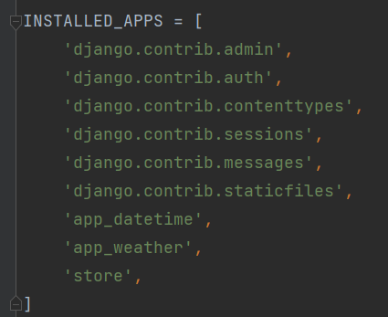

Существует подход активно используемый на практике, для обхода данных особенностей, этот подход заключается
в создании ещё одной папки с названием приложения в `templates` и переноса html файлов в данную папку, таким образом
даже если у двух приложений будут одинаковые названия файлов, то в `templates` они будут располагаться в своих
папках с приложениями и всё будет отображаться верно.

Вот как в итоге будет выглядеть путь `shop.html` в приложении `store`


Но, мы сменили путь к `shop.html`, а значит должны указать правильный маршрут в функции `render` нашего представления
`shop_view`

```python
def shop_view(request):
    if request.method == "GET":
        return render(request, 'store/shop.html')
```

Заходим на главную страницу и видим, что всё снова отображается верно.

### 2. Знакомство с тегом static

Представим такую ситуацию - нам срочно нужно переехать на новый сервер, но все 
статические файлы (картинки, скрипты javascript, css файлы) мы хотим перенести на отдельный сервер, чтобы
в случае чего данные проще было использовать, если что-то выйдет из строя. Но вот незадача, 
чтобы это сделать во всех наших html файлах нужно будет вручную поменять все ссылки на новый сервер, иначе
картинки на сайте просто не откроются.

Для того чтобы минимизировать ручные изменения ссылок в будущем, мы в текущем используем тег `static` который
считает шаблонизатор Django и при формировании html станицы в виде ответа - самостоятельно подставит нужный
начальный путь, где лежат картинки.

Но у данного подхода аналогичные особенности, как и у поиска html файлов:

1. Должна быть специальная папка `static` в приложении
2. Если вдруг в двух разных приложениях в папке `static` будут одинаковые файлы, то как и в случае с `templates`
файл загрузится из того приложения что будет выше в `INSTALLED_APPS`. Поэтому тут как и с `templates` продублируем
название приложения в виде папки в `static`

В итоге наше приложение `store` теперь выглядит так:


Поправим наш html файл `store.html` так как путь до статических файлов изменился.

Используем для этого тег ``

Для начала загрузим эту возможность в наш html файл, для этого вверху файла пропишем ``

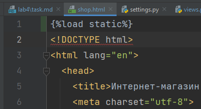

Затем все ссылки на статические файлы необходимо заменить с использованием тега `static`

Например ссылка (13 строка `shop.html`):

```html
href="static/css/open-iconic-bootstrap.min.css"
```
Трансформируется в (не забываем, что теперь наши статические файлы находятся в дополнительной папке `store`)

```html
href=""
```

А данная ссылка на 74 строке `shop.html`

```html
style="background-image: url(static/images/bg_1.jpg);
```
Трансформируется в 

```html
style="background-image: url();
```

И так необходимо сделать со всеми статическими файлами(картинки, css, js) в `shop.html`

Для облегчения работы можно воспользоваться поиском с заменой в файле. В файле 
`shop.html` нажмите комбинацию клавиш `Ctrl+R`, где появятся 2 поля:

* верхнее поле ищет текст, что написан;
* нижнее поле заменяет на текст, что написан;

Найдем `static/` и заменим на `{% static 'store/` (настоятельно рекомендую нажать Replace и
пройтись по каждой предложенной строчке, чтобы увидеть где-же в данном html находятся статические файлы)


Но одного открытого тега `"`  |
| `jpg`  | `jpg' %}`   |
| `png`  | `png' %}`   |
| `js"`  | `js' %}"`   |

Перезагрузите сервер и проверьте всё ли корректно работает

Если всё выполнено верно, то главная страница должна корректно отображаться.

Также корректность загрузки всех статических элементом можно проверить в консоли. Все файлы
будут с кодом 200, а не код 404.


### 3. Работа с параметрами передаваемыми в шаблон

Далее передадим данные о товарах в файл `shop.html` (для того, чтобы иметь возможность
при изменении товаров в DATABASE - товары автоматически менялись в магазине)

Для этого через параметр `context` функции `render` можно передать словарь, значения которого
будут использоваться для подставления значений в html файл.

В нашем случае в `shop_view` в `render` пропишем следующее

```python
return render(request, 
              'store/shop.html', 
              context={"products": DATABASE.values()})
```

В `context` передаём словарь с ключом `products` и всеми продуктами, что есть в базе данных

#### 3.1 Работа с тегом 

В `shop.html` найдём блок

```html
<div class="col-md-6 col-lg-3 ftco-animate">
```

Их всего 12 штук, ровно столько сколько есть товаров. В данном блоке содержится информация
о товаре.

До открытия этого блока поставьте тег открытия цикла 

``

а после закрытия блока продукта поставьте тег закрытия цикла

``

Или можете свернуть блок 


и до и после блока поставить теги


Конструкция `for product in products` выглядит довольно знакомо для Python, но
что такое `products`? `products` это равно тот ключ, что мы передавали в `context`.
Вот что передавали `context={"products": DATABASE.values()}` соответственно в `products`
у нас итерируемый объект со всеми продуктами.

Если зайти на главную страницу, то увидим множество клонов Болгарского перца, ровно 12
штук, именно столько товаров в `DATABASE.values()`.

Но хотелось бы иметь те товары, что есть в базе данных, а не 12 клонов одного товара.

Теперь мы подошли к понятию использования переменных шаблона. В шаблонизаторе обращение 
к объекту переменной идёт через `.`, когда в python по `[]`, поэтому, для обращения будем 
использовать:

| Описание          | Значение         | На что заменить            |
|-------------------|------------------|----------------------------|
| Скидка            | 30               | `{{product.discount}}`     |
| Название продукта | Болгарский перец | `{{product.name}}`         |
| Регулярная цена   | 300              | `{{product.price_before}}` |
| Цена со скидкой   | 210              | `{{product.price_after}}`  |


Если обратиться к главной странице, то увидим, что теперь описания и цены поменялись,
но неправильное отображение картинки товара и скидки


Поправим сначала картинку.

В данном примере работа с картинкой выбивается от общего паттерна, так как данная картинка уже в теге
``


а раз картинка в теге, то можно передать её значение без дополнительных скобок(если значение не в теге, 
то передаём как делали ранее через `{{}}`)

| Описание              | Значение                   | На что заменить        |
|-----------------------|----------------------------|------------------------|
| Расположение картинки | store/images/product-1.jpg | `product.url`          |


Вопрос с одинаковыми картинками решен, но со скидкой вопрос остался

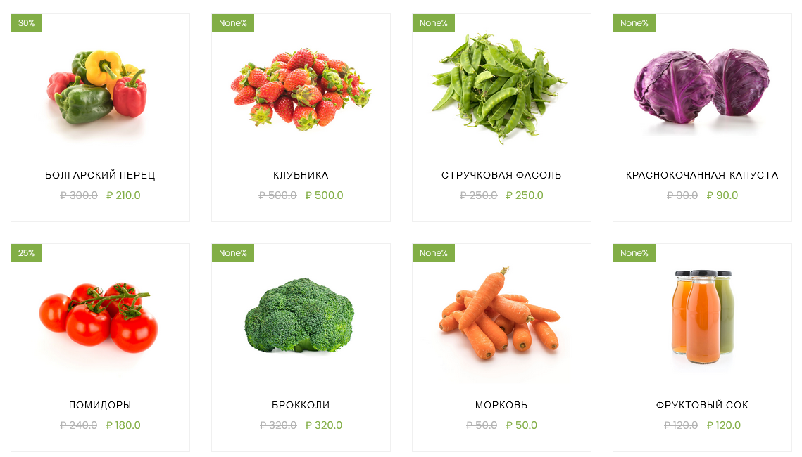

#### 3.2 Работа с условиям - тег 


Чтобы решить вопрос со скидкой нужно понять как поставить условие, так как если 
`{{product.discount}}` не None, то скидка есть, иначе отображается только одна цена, 
зеленая плашка слева вверху картинки не отображается. У языка шаблонов есть для этого
блок тегов `......`, который мы и используем.

Решим вопрос с зеленой плашкой и поставим блок тегов как на картинке(нового html кода нет, только размещены теги)


А с зачеркивающимися ценами поступим так, если скидка есть, то оставляем что есть, а если скидки нет,
то просто пишем регулярную цену `<span>&#x20bd {{product.price_before}}</span>`


Теперь всё отображается корректно, то товаров больше чем нужно, так как остальные 11
товаров после цикла отображаются. Удалим их. Для этого можете свернуть все блоки 
```html
<div class="col-md-6 col-lg-3 ftco-animate">
```
А затем удалить блоки после закрытого тега цикла.


После удаления


В итоге после удаление лишнего главная страница вернётся к правильному отображению. 
При этом мы храним меньше html кода.

#### 3.3 Работа с тегом 

Но вот незадача, при переходе по картинке товара, мы всё время переходим на Болгарский перец, вместо нужного товара (не обращаем внимания, что нет картинок при переходе,
это вызвано с изменением папки со статическими файлами, чтобы были ранее).

Данный переход связан с тем, что в цикле ссылаемся на постоянное значение ссылки


Для решения данной проблемы можно пойти несколькими путями: 

1. Ручное прописывание пути с параметром. В базе данных в ключе `html` лежит нужное значение


Данный подход череват тем, что если вы решите изменить маршрут по которому будет обрабатываться
информация о продукте, то придётся в html вручную исправлять ссылку.

2. Использование тега  возвращающего маршрут обработчика по имени обработчика

`href=""`


Но в таком подходе придётся именовать обработчики, что их затем можно было использовать для получения пути.

Для это в `urls.py` приложения `store` пропишем имя обработчика маршрутов через параметр `name`


Имя обработчику можно дать любое, главное чтобы было понятное.

Данный подход уже не завязан на ручном изменении, и изменение маршрута до обработчика 
не повлияет на результат перехода.

Однако существует вероятность, что вы назовете обработчики одинаково в двух разных приложениях (вспомните особенности папки 
static и templates), поэтому в данном случае можно разделить пространства имён обработчиков приложений.

Для этого в `urls.py` приложения `store` создадим переменную `app_name` и присвоим ей значение `'store'`


А уже в `shop.html` в теге `{}` пропишем пространство приложения 
``


Таким образом вы можете назвать обработчики одинаково в двух приложениях и быть уверенными, 
что они будут обрабатывать верно.

### 4. Работа с корзиной

Ранее мы работали с корзиной покупок через JSON, теперь же давайте подключим html файл для более наглядного отображения
данных.

Из папки `files/lab4` скопируйте *cart.html* в `store/templates/store`

В данном html файле уже прописаны статические файлы, так что осталось только прописать представление.

Чтобы не создавать нового представления давайте соединим, то что было ранее (возвращающее JSON) и то, что будет возвращать
html файл.

Чтобы совместить в одном представлении и JSON и html, 
предлагается разграничение при помощи параметра `format=JSON` в строке запроса, пример `http://127.0.0.1:8000/cart/?format=JSON`

Предлагается использовать данный код в представлении `cart_view`.

```python
def cart_view(request):
    if request.method == "GET":
        data = view_in_cart()
        if request.GET.get('format') == 'JSON':
            return JsonResponse(data, json_dumps_params={'ensure_ascii': False,
                                                         'indent': 4})
        return render(request, "store/cart.html")
```

Теперь при переходе на http://127.0.0.1:8000/cart получим представление корзины.

Но текущая возвращаемая корзина, не совпадает с той, что получаем в формате JSON. Давайте это поправим. В `cart_view`
допишем список продуктов которые есть в корзине. 

Вообще у нас если словарь с продуктами и их количеством в корзине. Но это всего лишь ссылки на id продукта, без характеристик продукта,
а они нам нужны. Для этого создадим словарь для хранения характеристик продукта, а затем эти данные передадим в шаблон
`cart.html` для заполнения через `render`

В `cart_view` допишите код, формирующий данные о характеристиках продукта, которые затем пойдут в `render`

```python
def cart_view(request):
    if request.method == "GET":
        data = view_in_cart()
        if request.GET.get('format') == 'JSON':
            return JsonResponse(data, json_dumps_params={'ensure_ascii': False,
                                                         'indent': 4})
        products = []  # Список продуктов
        for product_id, quantity in data['products'].items():
            product = ...  # 1. Получите информацию о продукте из DATABASE по его product_id. product будет словарём
            # 2. в словарь product под ключом "quantity" запишите текущее значение товара в корзине
            product["price_total"] = f"{quantity * product['price_after']:.2f}"  # добавление общей цены позиции с ограничением в 2 знака 
            # 3. добавьте product в список products

        return render(request, "store/cart.html", context={"products": products})
```

Осталось только подправить `cart.html`, чтобы те товары, что мы передавали в `render` теперь встали в правильное место.

Найдем `<tr class="text-center">` их будет 2 штуки, это и есть блоки с отображаемой информацией о товаре.

По примеру прошлого раза, когда работали с `shop.html` оборачиваем нашу строку с продуктами в цикл 
`...`


И заменяем следующие переменные

| Описание              | Значение                   | На что заменить              |
|-----------------------|----------------------------|------------------------------|
| Расположение картинки | store/images/product-1.jpg | `product.url`                |
| Название продукта     | Болгарский перец           | `{{product.name}}`           |
| Описание              | Сочный и яркий, он ...     | `{{product.description}}`    |
| Цена после скидки     | 210                        | `{{product.price_after}}`    |
| Количество товара     | value="1"                  | `value={{product.quantity}}` |
| Общая цена позиции    | 210                        | `{{product.price_total}}`    |


В итоге код строки товара будет в следующем виде

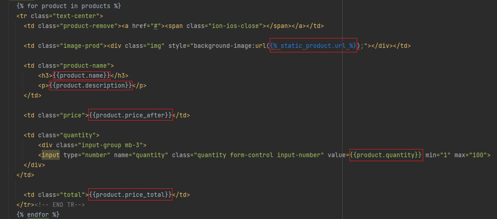

По стандарту удаляем все лишние блоки `<tr class="text-center">`

И если всё сделано верно, то в корзине будут товары с базы `cart.json`

Добавьте пару товаров как делали ранее через путь http://127.0.0.1:8000/cart/add/10, посмотрите что изменится.

Попробуйте удалить пару товаров из корзины.

Так как в `cart.html` много javascript кода, то при изменении количества товара прямо на странице - пересчитывает общая 
цена всей корзины на стороне клиента без перезагрузки страницы.


### 6. Создание и использование общих шаблонов для файлов

Если посмотреть на html файлы с которыми мы работали cart.html, shop.html, да и любой html из products, то есть определенные
блоки повторяющиеся в каждом файле.

Допустим можно посмотреть где же и всё различие между файлами. Для этого выделите два сравниваемых файла в нашем случае `cart.html` и `shop.html`
и нажмите правую кнопку мыши на них и выберите `Compare Files`

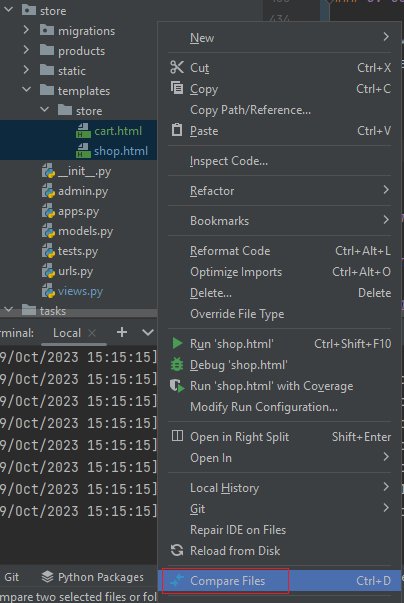

Появится окно в котором можно посмотреть, где существенные различия между файлами (синий цвет)

Основные различия идут после комментария `<!-- END nav -->`, когда заканчивается навигационный блок.

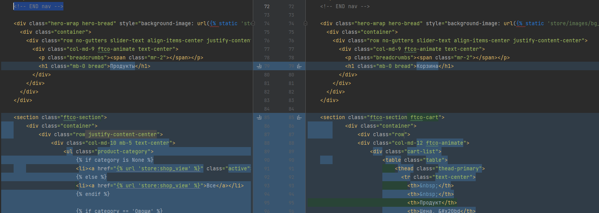

А начиная с секции `<section class="ftco-section ftco-no-pt ftco-no-pb py-5 bg-light">` снова всё повторяется


Исключение составляет блок с javascript, у `cart.html` есть дополнительные скрипты


В папке `store/templates/store` создадим шаблон `base.html` в нём будет заполненная структура шаблона (то, что чаще всего
повторяется в наших html файлах)

Заполните `base.html` данным кодом

```html

<!DOCTYPE html>
<html lang="en">
<head>
     <!-- Блок для названия страницы-->
    
    
    
     <!-- Блок ссылок в head-->

    
</head>
<body class="goto-here">
     <!-- Блок для header страницы с данными магазина-->

    
    
     <!-- Блок для навигационной панели страницы магазина-->

    
    
     <!-- Блок для уникального содержимого страницы-->
    
    
    
     <!-- Блок для новостной панели-->

    
    
     <!-- Блок для нижней панели страницы-->

    
    
     <!-- Блок для загрузки javascript страницы-->

    
    
      <!-- Блок для загрузки дополнительного кода встроенного в html-->

    
</body>
</html>
```

Далее из `shop.html` заполним содержимое блоков (то, что будет повторяться в разных html файлах)

В ` ... ` из `shop.html` скопируйте всё в теге `<head></head>` кроме 
`<title>Интернет-магазин здоровых продуктов</title>`

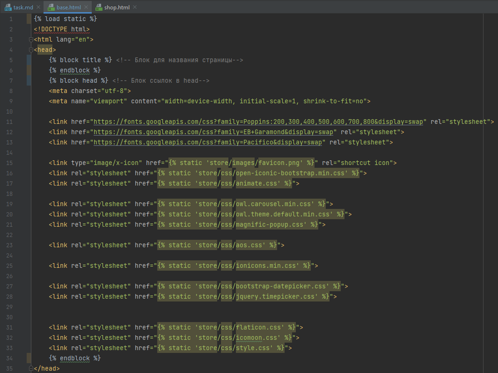

В ` ... ` из `shop.html` скопируйте блок `<div class="py-1 bg-primary">` с его содержимым

В ` ... ` из `shop.html` скопируйте блок 
`<nav class="navbar navbar-expand-lg navbar-dark ftco_navbar bg-dark ftco-navbar-light" id="ftco-navbar">` с его содержимым

В ` ... ` из `shop.html` скопируйте блок `<section class="ftco-section ftco-no-pt ftco-no-pb py-5 bg-light">` с его содержимым

В ` ... ` из `shop.html` скопируйте блок `<footer class="ftco-footer ftco-section">` с его содержимым

В ` ... ` из `shop.html` скопируйте содержимое от `<!-- loader -->` до закрывающегося тега `</body>`

В итоге блок `<body></body>` в base.html будет выглядеть так

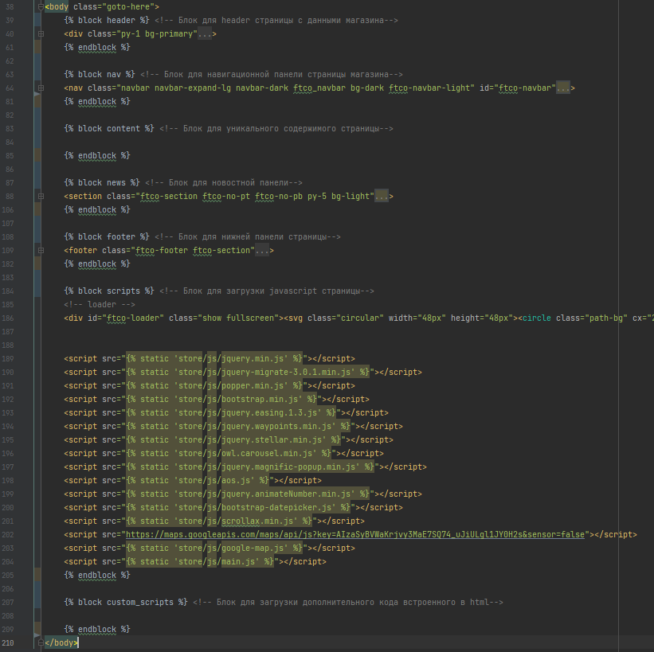

Теперь подготовим файл `shop.html`. В `shop.html` наверху пропишите тег для расширения файла шаблоном

```html

```

Затем в shop.html оставите только следующие блоки с содержимым (остальное удалите)

* `<title>Интернет-магазин здоровых продуктов</title>`
* `<div class="hero-wrap hero-bread" style="background-image: url();">`
* `<section class="ftco-section">`

Будет выглядеть следующим образом


Затем обернем всё в нужные теги (то, что будет использоваться в данном файле, но не будет в другом)

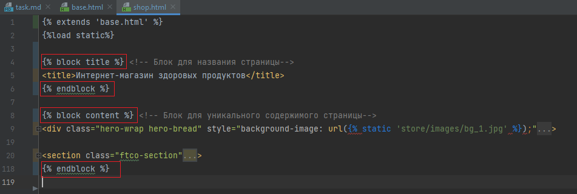

Теперь при обработке страницы из `base.html` всё перенесется в `shop.html`, а там где были пропуски у `` 
и `` теперь будут стоять данные, что есть в `shop.html`.

Если всё было перенесено верно, то теперь при открытии http://127.0.0.1:8000/ у вас верно отобразиться главная страница,
а значит расширение шаблона прошло успешно.

#### Самостоятельно

Аналогично как с `shop.html` проведите расширение шаблоном `base.html` для `cart.html`. В `base.html` ничего менять не нужно, 
а в `cart.html` необходимо удалить лишнее (что повторяется во всех файлах, блоки удаленные в `shop.html`). А теги
`` и `` заполнить нужными данными. Но в `cart.html` есть еще 4 отдельных javascript, которые будут в
блоке ``

В итоге должно выглядеть примерно так

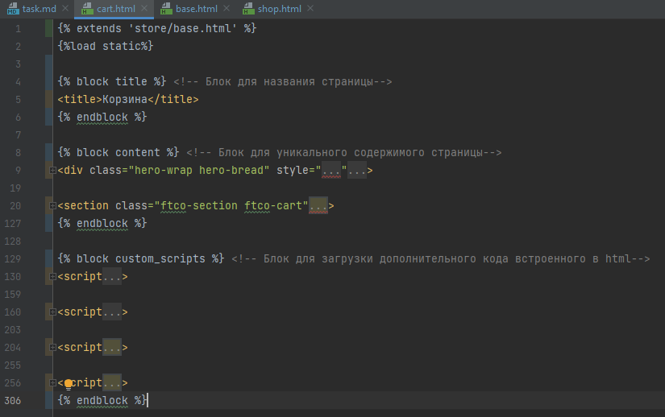

И если всё выполнено верно, то по http://127.0.0.1:8000/cart/ будет всё отображаться верно и все javascript будут 
работать верно.


### Практика окончена

Зафиксируем изменения сделав коммит и отправим эти коммиты на github

### Дополнительные (необязательные) задания для желающих:

### Доп.1 Применение фильтрации на главной странице

Ранее мы с вами делали функции способные фильтровать наши товары, вы даже сделали
представление возвращающее JSON с фильтрующими параметрами.

Теперь давайте применим это.

Скопируем код, что был ранее для фильтрации из параметров запроса представления
`products_view` и используем это для фильтрации товаров на главной странице.

Ниже приведен полный код `shop_view` с возможностью фильтрации

```python
def shop_view(request):
    if request.method == "GET":
        # Обработка фильтрации из параметров запроса
        category_key = request.GET.get("category")
        if ordering_key := request.GET.get("ordering"):
            if request.GET.get("reverse") in ('true', 'True'):
                data = filtering_category(DATABASE, category_key, ordering_key,
                                          True)
            else:
                data = filtering_category(DATABASE, category_key, ordering_key)
        else:
            data = filtering_category(DATABASE, category_key)
        return render(request, 'store/shop.html',
                      context={"products": data})
```

Теперь через адресную строку можно фильтровать. 


### Доп2. Фильтрация продуктов по нажатию на ссылку

Сделаем фильтрацию по нажатию ссылку категории 


Для этого в `urls.py` назовем обработчик

```python
path('', shop_view, name="shop_view")
```


Затем в представлении `shop_view` в словарь передадим какую категорию выбрали для фильтрации


И наконец в `shop.html` найдём `<ul class="product-category">`

И данные элементы списка 

```html
<li><a href="#" class="active">Все</a></li>
<li><a href="#">Овощи</a></li>
<li><a href="#">Фрукты</a></li>
<li><a href="#">Соки</a></li>
<li><a href="#">Семена</a></li>
```

Превратим в 

```html

<li><a href="" class="active">Все</a></li>

<li><a href="">Все</a></li>



<li><a href="?category={{category}}" class="active">Овощи</a></li>

<li><a href="?category=Овощи">Овощи</a></li>



<li><a href="?category={{category}}" class="active">Фрукты</a></li>

<li><a href="?category=Фрукты">Фрукты</a></li>



<li><a href="?category={{category}}" class="active">Соки</a></li>

<li><a href="?category=Соки">Соки</a></li>



<li><a href="?category={{category}}" class="active">Семена</a></li>

<li><a href="?category=Семена">Семена</a></li>

```

Здесь мы проверяем какая категория есть в параметрах переданных в шаблон, и затем
данную категорию делаем активной (появляется зелёная обводка)

Теперь при нажатии на ссылку категории происходит фильтрация

### Доп.3 Создание и настройка файла для отображения продуктов

Создайте файл `product.html` в `store/templates/store`. В `product.html` скопируйте содержимого любого из html файла
папки `store/products`, допустим `bell_pepper.html`.

Далее всё по стандартной схеме. Расширьте `product.html` файлом `base.html`. В блоке `` правильно пропишите
статические файлы, чтобы верно отрабатывался тег ``. Так же обратим внимание, что в продуктах есть блок "Товары той же категории"
который является тоже частью контента

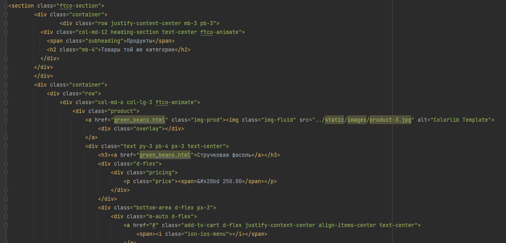

Так как не проверить правильное отображение страницы в текущих настройках, то изменим наше представление `products_page_view`
под использование функции `render`

```python
def products_page_view(request, page):
    if request.method == "GET":
        if isinstance(page, str):
            for data in DATABASE.values():
                if data['html'] == page:
                    return render(request, "store/product.html", context={"product": data})

        elif isinstance(page, int):
            # Обрабатываем условие того, что пытаемся получить страницу товара по его id
            data = DATABASE.get(str(page))  # Получаем какой странице соответствует данный id
            if data:
                return render(request, "store/product.html", context={"product": data})

        return HttpResponse(status=404)
```

На ниже приведенных картинках обведены значения которые можно получить из передаваемых данных (те что мы передаём через `render`)

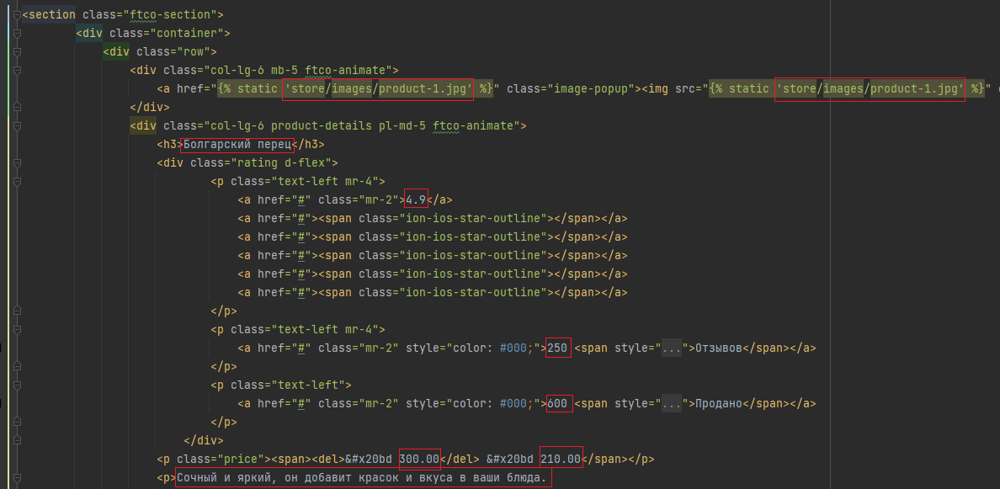

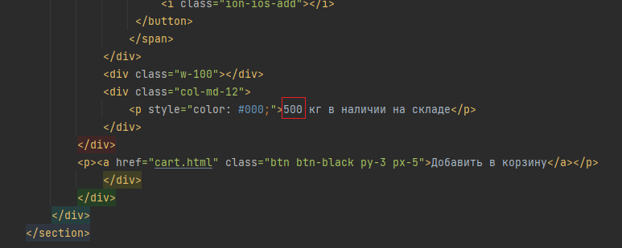

Данные взяты исходя из базы данных описанной в `models.py` приложения `store`

| Описание              | Значение                   | На что заменить               |
|-----------------------|----------------------------|-------------------------------|
| Расположение картинки | store/images/product-1.jpg | `product.url`                 |
| Название продукта     | Болгарский перец           | `{{product.name}}`            |
| Рейтинг продукта      | 4.9                        | `{{product.rating}}`          |
| Число отзывов         | 250                        | `{{product.review}}`          |
| Число продаж          | 600                        | `{{product.sold_value}}`      |
| Регулярная цена       | 300                        | `{{product.price_before}}`    |
| Цена после скидки     | 210                        | `{{product.price_after}}`     |
| Описание              | Сочный и яркий, он ...     | `{{product.description}}`     |
| Наличие на складе     | 500                        | `{{product.weight_in_stock}}` |

После замены при переходе на продукт из главной страницы будет показываться актуальный продукт.

Единственное есть 2 момента которые вам необходимо поправить:

1. Товары только с регулярной ценой теперь дублируют цены. Поправьте этот момент, вспомните как работали с условием
``, когда проверяли есть ли скидка на данный товар, если её нет, то отображать только регулярную цену.

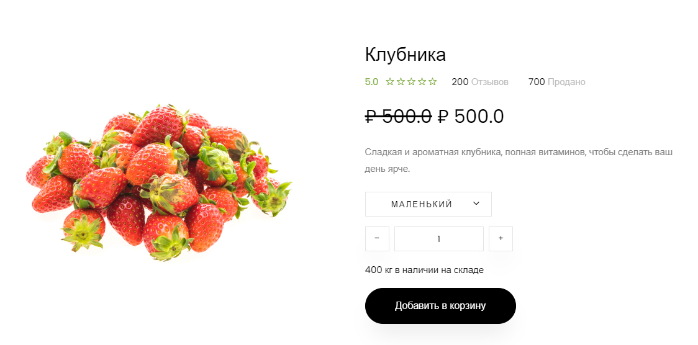

2. Блок "Товары той же категории" должен отражать актуальное состояние для категории. Т.е. если рассматриваем болгарский перец, 
то в блоке "Товары той же категории" будут перечислены товары категории "Овощи" той же самой, что и болгарский перец.
Только в этих товарах не должно быть болгарского перца, так как мы на странице перца. Количество товаров для 
отображения ограничено - не более 5 товаров.

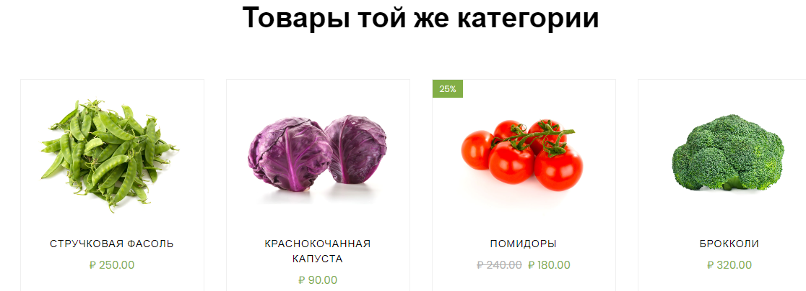
